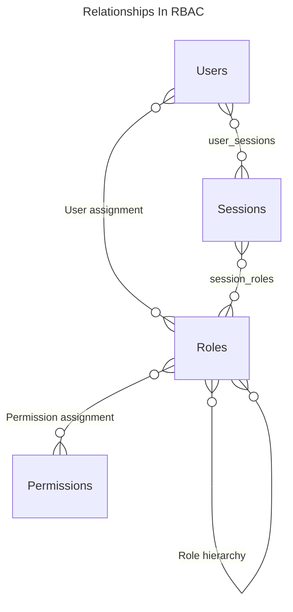
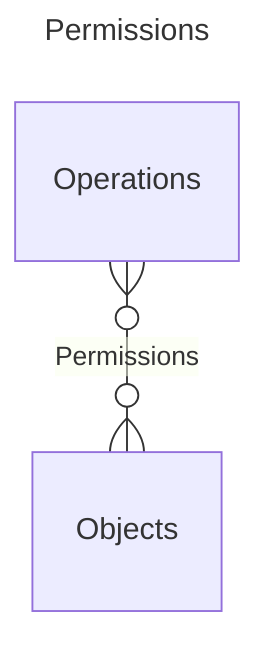

---
aliases:
  - RBAC
tags:
  - AccessControl
---
# Overview
Instead of giving permissions to user identities like [[Discretionary Access Control|DAC]], roles are used

- A user may have multiple roles
- An [[Discretionary Access Control#Access matrix|access matrix]] is used
	- Roles on rows
	- Objects on columns

# Reference models
There are a few example permission models for RBAC

## Basic
Known as $RBAC_0$

Has the following entities:
- User: someone with access to the system
	- Has a user ID
- Role: a named job within the organisation
	- Each role describes the authority and responsibilities of users with the role
- Permission
- Session: the subset of roles that a user has

## With hierarchies
Known as $RBAC_1$

$RBAC_{1}$ example (right)

- Extends $RBAC_{0}$ with role hierarchies
- Jobs with more responsibilities are granted access to more resources
- Roles inherit permissions from their parents

## With constraints
Known as $RBAC_{2}$

- Extends $RBAC_{0}$ with constraints
	- Constraints limit how the system can be configured
- Mutually exclusive roles
	- If a user has one role, they can't have the other
	- Makes it harder for organisation members from different departments to work together to breach security
- Cardinality
	- Max. role members
	- Max. roles per user
	- Max. roles with a permission
- Pre-requisite roles
	- A role that a user must have to be given another role

## Full model
Known as $RBAC_{3}$ ("consolidated model")

- Combines $RBAC_{1}$ and $RBAC_{2}$

# Relationships

- During a session, the user has a subset of their roles
	- This follows the principle of least privilege
