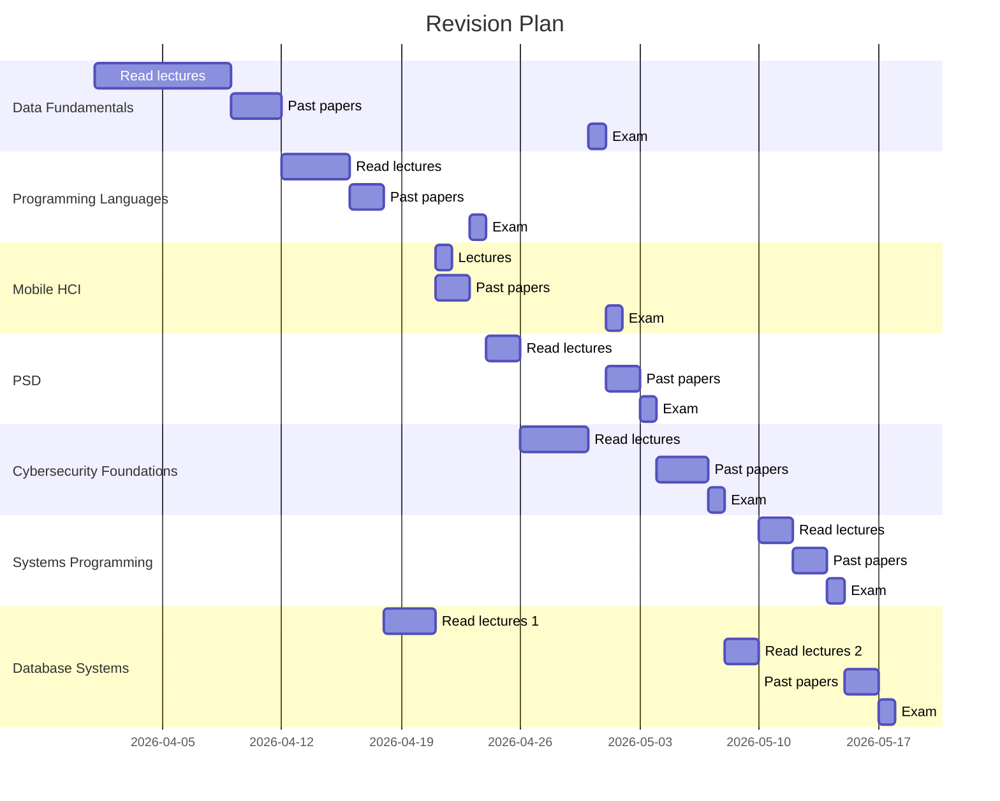

# Exam dates

| Class                     | Date  | Revision rating | Distance to last exam (days) |
| ------------------------- | ----- | --------------- | ---------------------------- |
| Programming Languages     | 23/04 | 6               | 22                           |
| Data Fundamentals         | 30/04 | 10              | 7                            |
| Mobile HCI                | 01/05 | 3               | 1                            |
| PSD                       | 03/05 | 4               | 2                            |
| Cybersecurity Foundations | 07/05 | 8               | 4                            |
| Systems Programming       | 14/05 | 7               | 7                            |
| Database Systems          | 17/05 | 10              | 3                            |

| Class                      | Days allocated |
| -------------------------- | -------------- |
| Data Fundamentals          | 11             |
| Cybersecurity Fundamentals | 7              |
| Database Systems           | 7              |
| Programming languages      | 6              |
| PSD                        | 4              |
| Systems Programming        | 4              |
| Mobile HCI                 | 2              |
